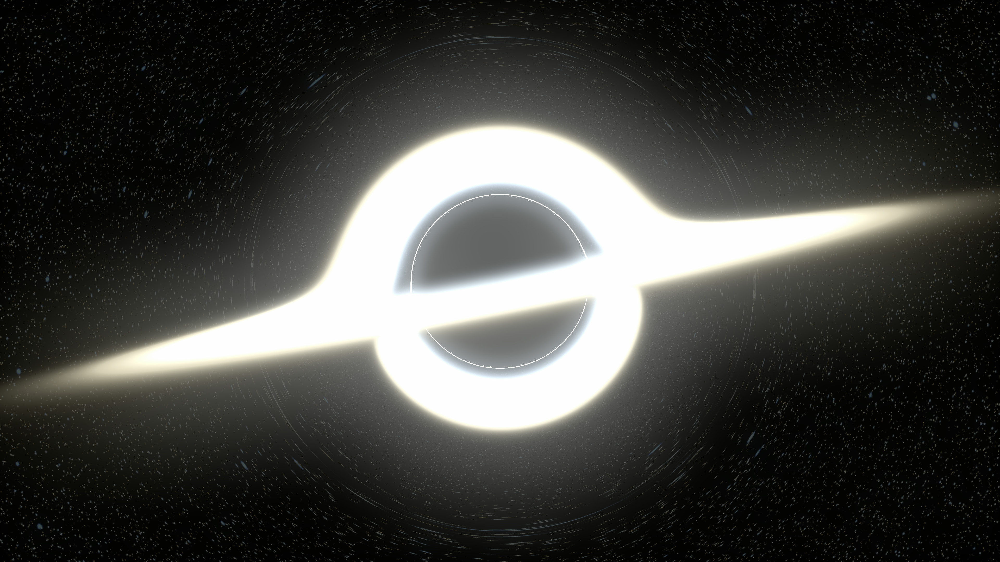

# CUDA BlackHole

Project of generating black hole with accretion disk. It uses GPU for creating an image. 

## Motivation 
This project was created after watching Christofer Nolan's [_Interstellar_](https://www.imdb.com/title/tt0816692/) movie. First idea was to read an [article](https://arxiv.org/pdf/1502.03808.pdf) about creating blackhole image for _Interstellar_. This research is nice, but definitely too hard for me to implement these equations. In Appendix A.5 of this article there are informations about time needed to create single image. My question was simple: _'Why not to use GPU?'_  
Then I found github project which was perfect. Please read further text for more informations. [⬇️](#black-hole-🌌) 

## Black hole 🌌
Raytracing algorithm is based on [starless](https://github.com/rantonels/starless) project created by [Rantonels](https://github.com/rantonels). His project is amazing, making difficult physics equations as simple as possible. If You want to find details about black hole equations or about other science stuff, please go to [starless](https://github.com/rantonels/starless) page. In this README I will __not__ include these informations.

## CUDA 
Project uses GPU to generate whole image: from background through blackhole and accretion disk to glow effect. 
It uses Nvidia CUDA to improve generation time. I used some libraries, which helps to achieve final result: 
 - [cuRAND](https://docs.nvidia.com/cuda/curand/index.html) 
 - [nvJPEG](https://docs.nvidia.com/cuda/nvjpeg/index.html)

## Features 📋
 - generating sky 
 - raytracing blackhole & accretion disk
 - optional [Doppler effect](https://en.wikipedia.org/wiki/Relativistic_Doppler_effect) on accretion disk
 - save final result as _.jpeg_ or _.bmp_

## How to build and run ⚙️
The most important thing is to have:
 - CUDA SDK (version 10+ cause of nvJPEG library)
 - Visual Studio (2019 or newer)
I use Visual Studio with [Nsight Integration](https://developer.nvidia.com/nsight-visual-studio-edition) extension. Mainly it allows me to debug GPU code and manage project specification (CUDA part).  
1. Open ___CUDA_BlackHole.sln___ file with Visual Studio.
2. If there are any problems with opening project, You may need to change CUDA version in file ___.vcxproj___. Just replace all occurences of `11.x` with Your CUDA SDK version.  
__Q:__ How Can I check my CUDA SDK version?   
__A:__ In Your terminal run command `nvidia-smi`, there will be field _CUDA Version:_ or something similar.  
3. To run project just click `Run without debugging` button. There is important to change DEBUG configuration to RELEASE.

### Config.h
___Config.h___ file contains most of configuration parameters. Short explanation of some of them:
 - `DIM_X` & `DIM_Y`: size of image in pixels, _width_ & _height_
 - `JPEG`: to determine if final image should be save: as _.jpeg_ if this directive exist, or _.bmp_ if not.
 - `FILENAME`: name of output image file (it need file extension in the string, eg. `blackhole.jpeg`).
 - `GAUSS_SIZE` & `GAUSS_SIZE_SMALL`: size of gaussian blur effect size in pixels. Small version is used to smooth accretion disk, value should be about 6-7x smaller than `GAUSS_SIZE`, but not bigger than 150.

---

## Research 🔬
This section contains descriptions of some cool features which allows to speed up algorithm with time measurements.  
All tests below were done on laptop with: 
 - Intel i7-11800H
 - RTX 3070 Laptop GPU 
 - 16GB DDR4 3200MHz.   

For time measurements I use [Nvidia Nsight Systems](https://developer.nvidia.com/nsight-systems) program, which allows to measure execution times (what a suprise ...). It measure execution time of every single `__global__` function run on GPU and memory operations.

### Implementation
This section will describe some informations about implementation, methods, improvements and time results. This part contains some details of implementation, so if You are interested in understanding my code in details, this is valueable part of this README.

#### __Generating sky__
Background sky is generated real-time every time image is created. Well, of course, generate and save background once, then loading from memory is faster but who cares... . Stars sizes and temperatures are taken from [Wikipedia - Stellar Classification](https://en.wikipedia.org/wiki/Stellar_classification). Colors are taken from [starless](#black-hole-🌌) project (in that project You can find original source link). Background needs to be 16x bigger than output image, so higher resolution need a lot of memory (8K image (7680x4320 pixels) need 2,8GB VRAM).  
Sequential stars drawing will take so long (above 2'000'000 stars with mean diameter about 2), so I needed to improve this. How about drawing stars in parallel? Good idea but how to ensure that close stars won't be drawn in the same time? Answer was to create short loop, each iteration draw stars where their center coords where euqals to each other and equals iteration step.  
For example: 
 - 0th iteration: all stars with center coords modulo 16 = (0, 0) (16 if star radius is < 8, always needs number twice bigger than star radius)
 - 1st iteration: all stars with center coords modulo 16 = (1, 0)   
 ...
 - 16th iteration: coords = (0,1)  
 ...
 - 255th iteration: coords = (15,15)

#### __Gaussian blur__
Blackhole accretion disk is very bright so it needs some glow effect. This effect is can be achieved by adding Gaussian blur on the top layer of image. It isn't hard to find [equations](https://en.wikipedia.org/wiki/Gaussian_blur) to create convolution matrix. But I needed bigger matrix than 3x3 or 5x5, let's assume 1000x1000 (Ouch!). Firstly I would need matrix with 1 milion elements (almost 1MB memory which is not so bad). Secondly, EACH pixel will be generated by multiplying and adding 1000\*1000=1'000'000 float numbers (Ouch! ^2).  
But there is a hope! Gaussian function is very special, two-dimensional blur can be implemented as two independent one-dimensional functions (one horizontal and second vertical). But why this is so important? Well, typical two dimensional gaussian blur takes m\*n operations per pixel (please remember that I need 1000x1000 matrix). Two one-dimensional filters takes only m+n (‼️) operations per pixel. Other advantage is that smaller array is needed (1000 instead of 1000*1000 elements). Improvement is very big, I will give exmaple. On resolution 1920x1080 pixels (in brackets array length):
| version | time (ms) |
|:-------:|:---------:|
| 2D gauss (101x101) | 83 | 
| 2x 1D gauss (501) | 7 |

__Q:__ Wait! How can I compare these results? Different sizes and ... you know ...      
__A:__ Maybe... Well, all You should know is that second version is faster, much faster.  

### CUDA
This section is focused on CUDA properties which allows to reduce time needed to create image. This section contains some technical informations about how GPU and CUDA works. If you want to develop applications using CUDA or just to learn something new, this is part for You. 

#### `--use_fast_math` __compiler option__
__nvcc__ compiler has many options. One of these may interest some of You. `--use_fast_math` option replace many math functions with faster versions. These functions makes approximations of mathematical functions with accuaracy called [ULP](https://hal.inria.fr/inria-00070503/document) (_unit in the last place_).  
__Q:__ What is ULP? I don't want to read the article...  
__A:__ OK. In brief, ULP is a difference between calculated value and real mathematical value.  
For more informations about these functions please read [Nvidia's documentation (Appendix H)](https://docs.nvidia.com/cuda/pdf/CUDA_C_Programming_Guide.pdf)

#### __Pinned memory__
Memory used by CPU is paged by default. GPU cannot access pageable memory directly. To copy data between host and device, CUDA driver allocate temporary pinned (sometimes called _page-locked_) memory array.
CUDA allows to allocate pinned memory directly. It allows to speed up data transfer.  
__Q:__ What exactly we need to do?  
__A:__ Instead of allocating CPU memory using e.g. `malloc(1024*1024*sizeof(float))`, it exists special function `cudaHostAlloc(1024*1024*sizeof(float))` which allocate pinned memory.  
I will give an example: copying 3,5MB of memory from GPU to CPU (direction isn't important).
| version | throughput (GiBs/s) |
|:-------:|:---------:|
| pageable | 6,74 | 
| pinned | 26,17 |

As You can see, difference is huge. Of course everything has two sides of the same coin. Allocating too much CPU memory as pinned can decrease efficiency of processing data on CPU, so please be careful allocating next 2GB of pinned memory.  

### Time results
These results shows total time of GPU computation, __not__ include creating _.bmp_ or _.jpeg_ file. Of course, results depend on the machine on which time will be measured. RAM usage is the maximum amount used at the same time. Through the computation, parts of memory are deallocated to reduce usage.
| resolution | time (ms) | RAM max usage (GiB)|
|:----------:|:---------:|:------------:|
|1920x1080   |25        | 0,18 |
|3820x2160   |250       | 0,72 |
|7640x4320   |1020      | 2,81 |   

